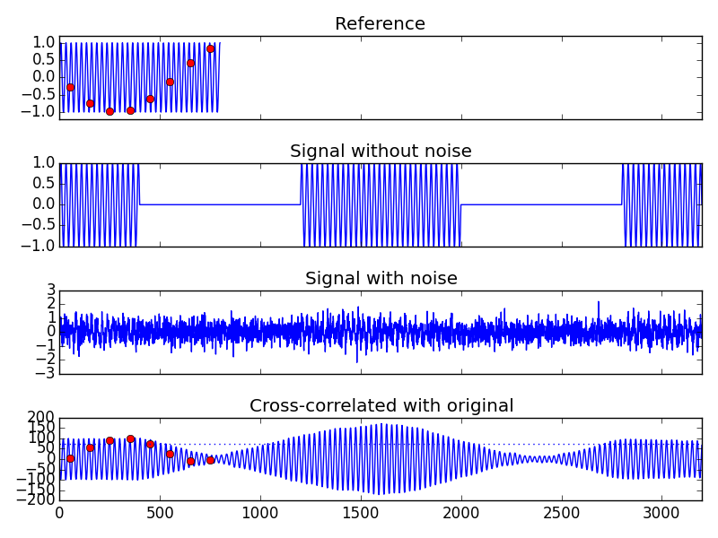

selcald
=======

Selcal decoder daemon
---------------------

A Linux/BSD daemon that monitors an audio stream and looks for selcal 
(Selective Calling; see <https://en.wikipedia.org/wiki/SELCAL>) calls and 
emits a timestamp, followed by the selcal code received. The daemon is 
intended to be as simple and lightweight as possible, and should rely 
on existing frameworks such as fftw where possible.

[Selective Calling (SELCAL)][1]
--------------------------

SELCAL is a technique that allows a ground radio operator to alert an 
aircrew that the operator wishes to communicate with that aircraft.

Because of the background noise level experienced on HF radio frequencies, 
aircrews usually prefer to turn down the audio level of their HF receiver 
until alerted via SELCAL of a message specifically intended for their 
aircraft. When the ground station operator wishes to communicate with an 
aircraft, he enters into the SELCAL encoder the 4-letter code of that aircraft, 
which is usually included in its flight plan, and transmits that code over the 
assigned radio channel. All aircraft monitoring that channel receive the 
SELCAL broadcast, but only those (preferably only one) that have been 
programmed with that 4-letter code will respond by sounding a chime or 
otherwise alerting the crew. The crew will then set their volume control 
higher to listen to the voice traffic and, using ICAO recommended radio 
procedures, assure that the message is intended for them.

[Selcal Specification][2]
--------------------
The official specification for the selcal system is found in 
"ARINC Characteristic 714-6-1990", published on August 15, 1990. The key 
attributes of selcal codes are as follows:

### General

Selective calling is accomplished by the coder of the ground transmitter 
sending coded tone pulses to the aircraft receiver and decoder. Each 
transmitted code is made up of two consecutive tone pulses, with each pulse 
containing two simultaneously-transmitted tones.

### Transmitted Code

When the ground operator desires to call a particular aircraft, he depresses 
the buttons corresponding to the code assigned to that aircraft. The coder 
then keys the transmitter on the air causing to be transmitted two 
consecutive tone pulses of 1.0 +/- 0.25 sec. duration, separated by an 
interval of 0.2 +/- 0.1 sec. which makes up the code. Each tone pulse 
consists of two simultaneously-transmitted tones. The call should consist 
of one transmitted code without repetition.

### Stability

The frequency of transmitted codes should be held to +/- 0.15% tolerance to 
insure proper operation of the airborne decoder.

**NOTE:** The specification does not indicate the required frequency accuracy of
the receiver. Given that [research][3] seems to [show][4] that doppler spreads of 
5-20 Hz over polar paths are possible, it seems that as a practical matter, 
the receiver frequency tolerances have to be more relaxed than the transmitter 
frequency tolerances.

### Distortion

Overall audio distortion present on the transmitted RF signal should not 
exceed 15%.

### Percent Modulation

The RF signals transmitted by the ground radio station should contain within 
3 dB of equal amounts of the two modulating tones. The combination of tones 
should result in a modulation envelope having a nominal modulation percentage 
of 90% and in no case less than 60%.

### Transmitted Tones

Tone codes are made up of various combinations of the following tones and 
are designated by letter as indicated:

Note: The tones are spaced by log-1 0.045 (approximately 10.9%)

| Designation | Nominal Frequency (Hz) | Minimum  | Maximum  | Width |
| ----------- | ---------------------- | -------- | -------- | ----- |
| A           | 312.60                 | 312.13   | 313.07   | 0.94  |
| B           | 346.70                 | 346.18   | 347.22   | 1.04  |
| C           | 384.60                 | 384.02   | 385.18   | 1.15  |
| D           | 426.60                 | 425.96   | 427.24   | 1.28  |
| E           | 473.20                 | 472.49   | 473.91   | 1.42  |
| F           | 524.80                 | 524.01   | 525.59   | 1.57  |
| G           | 582.10                 | 581.23   | 582.97   | 1.75  |
| H           | 645.70                 | 644.73   | 646.67   | 1.94  |
| J           | 716.10                 | 715.03   | 717.17   | 2.15  |
| K           | 794.30                 | 793.11   | 795.49   | 2.38  |
| L           | 881.00                 | 879.68   | 882.32   | 2.64  |
| M           | 977.20                 | 975.73   | 978.67   | 2.93  |
| P           | 1,083.90               | 1,082.27 | 1,085.53 | 3.25  |
| Q           | 1,202.30               | 1,200.50 | 1,204.10 | 3.61  |
| R           | 1,333.50               | 1,331.50 | 1,335.50 | 4.00  |
| S           | 1,479.10               | 1,476.88 | 1,481.32 | 4.44  |

### Table of Tone Frequencies and Derivation of the Frequencies

fN = log-1 / 0.045 (N-1) + 2.00/. For the first tone, N=12, second N=13, etc.

| Designation | Log Frequency | Frequency (Hz) |
| ----------- | ------------- | -------------- |
| A           | 2.495         | 312.6          |
| B           | 2.540         | 346.7          |
| C           | 2.585         | 384.6          |
| D           | 2.630         | 426.6          |
| E           | 2.675         | 473.2          |
| F           | 2.720         | 524.8          |
| G           | 2.765         | 582.1          |
| H           | 2.810         | 645.7          |
| J           | 2.855         | 716.1          |
| K           | 2.900         | 794.3          |
| L           | 2.945         | 881.0          |
| M           | 2.990         | 977.2          |
| P           | 3.035         | 1083.9         |
| Q           | 3.080         | 1202.3         |
| R           | 3.125         | 1333.5         |
| S           | 3.170         | 1479.1         |

Signal Processing
-----------------

Detection of the selcal tones is quite similar to DTMF tone detection, and 
this has been well documented. There are several approaches available:

1. Bandpass filter bank and energy detectors (i.e. analog implementation approach)
2. Discrete FFT and energy detection in bins containing selcal tones
3. Goertzl algorithm for fast DFT (see <https://en.wikipedia.org/wiki/Goertzel_algorithm>)
4. Chirp-Z transform for DFT (see <https://en.wikipedia.org/wiki/Bluestein%27s_FFT_algorithm>)
5. MUSIC algorithm (see <https://en.wikipedia.org/wiki/Multiple_signal_classification>)
6. ESPRIT algorithm (see <https://en.wikipedia.org/wiki/Estimation_of_signal_parameters_via_rotational_invariance_techniques>)
7. Wavelet transform and convolution (seems highly advanced)
8. Q Transform (handles geometric spacing of tones/bins much better)

The implementation should take into account characteristics of the HF radio medium:

* Often poor signal/noise ratio
* Frequent ionospheric and auroral fading and flutter
* Slight doppler due to relative ionospheric motion

These imply that unlike DTMF decoder implementations, a series of measurements should 
be made during the signal and a final decision determined from statistical analysis 
of the raw measurements. Based on the highest baseband frequency of approximately
1500 Hz, this means that any audio sampling rate above 4000 samples/second should work
fine. Looking at the post-detection stage, we can see that the gap between the two tone 
groups is specified as 200 mS +/- 100 mS, so in the worst case, the gap could be 100 mS. 
Following Nyquist and sampling theory, this means that in that 100 mS period, we need to
check for the presence or absence of signal at least twice, or once every 50 mS. The actual
numbers will vary based on audio sampling rates, but for the typical 44100 samples/second
rate of modern sound cards, this leads us to use a block size of 2048 (using a nice round
binary number) and a post-processing sample rate of 2048/44100 or 46.4 mS. This also means
that we need to window this sample size appropriately and choose an algorithm for tone
detection that is "comfortable" with this block size.

After considerable trolling through the Internet, and discarding many approaches
(see above) that are oriented toward detecting _unknown_ tones, it seems that 
theoretically, the ideal approach is to use [cross-correlation][5] of the input signal with
_known_ signals to detect their presence, otherwise known as [matched filtering][6].

Some care must be taken in selecting the block size, as it is a tradeoff between 
integrating more signal power to improve cross-correlation detection, and added 
difficulty in detecting the silent period between the tone groups. As mentioned 
earlier, presumably for direct detection of the shortest possible silent period, 
blocks should be less than 50 mS, but this would result in requiring detection 
based on only 15 cycles (312.6 Hz * 0.05 sec) for the lowest frequency tone.

The normal source of sampled audio is the soundcard interface. 
After some digging, it seems that PortAudio would be a good choice for an audio interface
API, since it provides both a degree of platform independence and isolates the application
from the various underlying audio frameworks (i.e. ALSA, Pulseaudio, SndKit, etc.).
In general, lower sampling rates are preferred due to the reduced processing load, 
as are fixed point DSP implementations versus floating point implementations.

### Pseudocode

    Calculate number of samples per block size (<= 50 mS)
    For each tone in the alphabet
      Generate the template signal for cross-correlation
    While true
      Clear signal table
      set signal table row to 0
      read audio samples for one block
      apply windowing function to block
      apply bandpass filter to block
      For each tone in the alphabet
        Convolve the input signal with the template for the tone
        If the cross-correlation reaches the detection threshold
          Then this letter in the alphabet has been detected
      add tones detected to signal table
      if two tones detected
        For remaining number of blocks
          increment signal table row
          read audio samples for one block
          For each tone in the alphabet
            Convolve the input signal with the template for the tone
            If the cross-correlation reaches the detection threshold
              Then this letter in the alphabet has been detected
          add tones detected to signal table
        Read signal table and determine selcal code

References
----------
[1]: http://www.asri.aero/our-services/selcal/ "Aviation Spectrum Resources Inc. website, retrieved 3, Nov 2013"

[2]: http://store.aviation-ia.com/cf/store/catalog_detail.cfm?item_id=126 "ARINC Characteristic 714-6-1990, chapter 2; August 15, 1990"

[3]: https://lra.le.ac.uk/bitstream/2381/7403/3/propagation%20of%20HF%20radio%20waves.pdf "Propagation of HF radio waves over northerly paths: measurements, simulation and systems aspects, Warrington et al"

[4]: http://onlinelibrary.wiley.com/doi/10.1002/2013RS005264/full "Observations of Doppler and delay spreads on HF signals received over polar cap and trough paths at various stages of the solar cycle, Stocker, A. J., E. M. Warrington, and D. R. Siddle (2013), Radio Sci., 48, 638–645, doi:10.1002/2013RS005264"

[5]: https://en.wikipedia.org/wiki/Autocorrelation "Autocorrelation"

[6]: https://en.wikipedia.org/wiki/Matched_filter "Matched filter"
