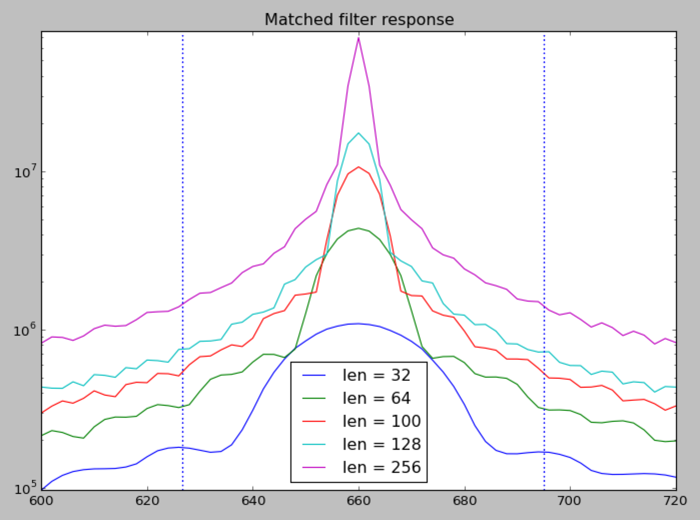

Notes
=====

Matched Filtering
-----------------

Currently, we are cross-correlating against standard tones in the alphabet that
are of constant duration. This is probably a mistake because the length of 
the tone we are correlating signal against will determine the matched filter 
bandwidth; they should be a constant number of cycles instead. Otherwise, the 
bandwidth for each tone in the alphabet will be different than the others,
with the high tones having a narrower bandwidth than the lower ones.

I need to characterize the cross-correlation frequency response more precisely. 
I suspect that the longer the reference tone is, the trade off is that there
is more integration of the desired signal, but the frequency response becomes
narrower.

Also, the duration of the cross-correlation needs to be considered: A perfect
cross-correlation would be one second of a SELCAL code correlated with one 
second of received data. However, this would result is a very narrow receiver
bandwidth. The compromise could be correlating one second of received data 
with an appropriately sized reference tone.

Alternatively, the received signal could be broken into frames, each one being
the same size as the reference tone.

Sample Processing
-----------------

Some live captures have very strong signals, and the SciPy spectrogram seems to
show spurious signals in many of these. Perhaps some AGC pre-processing is 
warranted.

Some unwanted high-frequency roll-off is observed if large decimations are 
taken. This was seen with decimations down to ~3700 samples/second, which
should be sufficient to deal with the highest frequency of ~1400 Hz. It is not
clear if this is related to excessive decimation or not, but the roll-off seems
less if the decimation is reduced to ~11000 samples/second.

AM vs SSB, Clock Errors, etc.
-----------------------------

Not sure how we can implement this, but the classical problem with these kind of
decoders, when applied to a SSB receiver and a computer sound card, is that there
are inevitably frequency errors.

The real-world aircraft radios have two separate receivers in them; one is AM, and
is always on, and all it does is look for the SELCAL tones. Because it is AM, there
is never any frequency error on the tones, other than what is introduced at the 
transmitter. The tones are decoded, and if they match the aircraft SELCAL code, the
SSB receiver audio channel is enabled.

Most hobbyists are not willing to dedicate two receivers to the task of receiving
SELCAL codes, so we need to get creative. I wonder if instead of looking for two
tones of a specific frequency, we should instead look for two tones with a specific
difference in frequency between them? This would eliminate the need to use an AM
receiver, and mitigate the effects of a mistuned SSB receiver or a skewed PC sound
card sampling clock.

